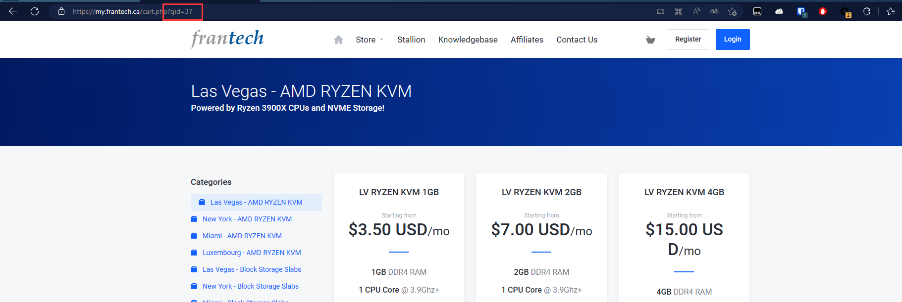

# A program to monitor buyvm replenishment
### How to use: 
1. Clone this repo.
2. Install dependent libraries `httpx`,`lxml`,`beautifulsoup4` through pip:
   ```bash
   pip install -r requirements.txt
   ```
3. You need to modify the variable `gids` in line 35 of `bot.py` to the list of gids which you want to monitor. You can look for gid as shown below.
     
4. To set notification method, You need to modify line 41,42 in `bot.py`. The script uses the [Wecomchan project](https://github.com/easychen/wecomchan) (the open source implementation of serverchan) as the notification method.
5. Run `bot.py`